```
██████╗  ██████╗ ██████╗  █████╗ ███╗   ███╗██╗███╗   ██╗███████╗
██╔══██╗██╔═══██╗██╔══██╗██╔══██╗████╗ ████║██║████╗  ██║██╔════╝
██║  ██║██║   ██║██████╔╝███████║██╔████╔██║██║██╔██╗ ██║█████╗  
██║  ██║██║   ██║██╔═══╝ ██╔══██║██║╚██╔╝██║██║██║╚██╗██║██╔══╝  
██████╔╝╚██████╔╝██║     ██║  ██║██║ ╚═╝ ██║██║██║ ╚████║███████╗
╚═════╝  ╚═════╝ ╚═╝     ╚═╝  ╚═╝╚═╝     ╚═╝╚═╝╚═╝  ╚═══╝╚══════╝
```

# **Dopamine Trading System**
*A Neuromorphic AI Trading Platform with Unified Reward Engine*

**Dopamine** is a fully autonomous, self-evolving black-box trading algorithm for MNQ futures that mimics neurological reward systems. Built with a centralized reward engine, **complete 5-timeframe integration (1m, 5m, 15m, 1h, 4h)**, and dopamine-inspired learning mechanisms, it discovers optimal trading strategies through economic incentives and real-time P&L feedback.

### 🌟 **Latest Enhancement: Complete 5-Timeframe Integration**
- **Cross-Timeframe Neural Attention**: Neural networks process all 5 timeframes simultaneously
- **Enhanced Trend Alignment**: Sophisticated consensus scoring across all timeframes  
- **Hierarchical Timeframe Weighting**: 35% 4h, 30% 1h, 20% 15m, 10% 5m, 5% 1m
- **Complete Feature Extraction**: Trend and volatility tracking for every timeframe
- **Multi-Timeframe Learning**: All subsystems learn patterns across the full spectrum

---

## 🧠 **Core Philosophy**
- **Neuromorphic Learning**: Mimics dopamine reward pathways for immediate P&L feedback
- **Economic Evolution**: All parameters learned through profit/loss incentives
- **Unified Rewards**: Centralized reward engine consolidates all feedback mechanisms
- **Autonomous Discovery**: No hardcoded rules - AI learns optimal behavior through experience

---

## 🚀 **Key Features**

### 🧬 **Unified Reward Engine**
- **Centralized Logic**: All reward calculations in `agent/reward_engine.py`
- **Dopamine Component**: Real-time P&L reward system with momentum tracking
- **Rejection Engine**: Economic penalties for trade violations with escalation
- **Modular Design**: Core, dopamine, and rejection engines with consistent interface

### 🎯 **Autonomous Intelligence**
- **5-Timeframe Analysis**: Complete integration across 1m, 5m, 15m, 1h, 4h timeframes
- **Cross-Timeframe Attention**: Neural networks process all timeframes simultaneously
- **Position-Aware Learning**: Economic penalties teach position limits (-$15+ violations)
- **Context-Dependent Holding**: Rewards patience vs penalizes missed opportunities
- **Real-Time Adaptation**: Works with NinjaTrader at 1x-10x replay speeds
- **Self-Evolving Architecture**: Neural networks adapt structure based on performance

### 🛡️ **Smart Risk Management**
- **Economic Enforcement**: Violations cost more than potential profits
- **Emergency Exits**: Position reversals always allowed for risk management
- **Escalating Penalties**: Repeated violations get exponentially worse
- **Account-Aware Scaling**: Risk parameters automatically adjust for account size

---

## 🏗️ **System Architecture**

```mermaid
graph TB
    subgraph "🧠 Intelligence Domain - 5-Timeframe Analysis"
        IE[Intelligence Engine<br/>5-TF Multi-Analysis]
        DNA[DNA Subsystem]
        TEMP[Temporal Subsystem]
        IMM[Immune Subsystem] 
        MICRO[Microstructure Subsystem]
        DOPA[Enhanced Dopamine<br/>Psychology System]
        EDOPA[Dopamine Subsystem<br/>Legacy Support]
    end
    
    subgraph "🤖 Agent Domain - Enhanced Learning"
        TA[Trading Agent<br/>5-TF Decision Making]
        ML[Meta Learner]
        RTA[Real-Time Adaptation]
        RE[Unified Reward Engine]
        CONF[Confidence Manager]
    end
    
    subgraph "🧪 Neural Domain - Cross-Timeframe Networks"
        AN[Self-Evolving Network]
        EN[Enhanced Neural<br/>5-TF Attention]
        UE[Uncertainty Estimator]
        CTA[Cross-Timeframe<br/>Attention]
    end
    
    subgraph "💰 Risk Domain"
        RM[Risk Manager]
        ARM[Advanced Risk Manager]
        PM[Portfolio Manager]
        RLE[Risk Learning Engine]
    end
    
    subgraph "📊 Market Domain - Multi-Timeframe Data"
        DP[Data Processor<br/>5-TF Bar Builder]
        MA[Market Analysis]
        MMA[Microstructure Analyzer]
        TF["1m|5m|15m|1h|4h<br/>Real-time Bars"]
    end
    
    subgraph "🎭 Personality Domain - AI Commentary"
        TP[Trading Personality<br/>Enhanced Context]
        EE[Emotional Engine]
        LC[LLM Client]
        PI[Personality Integration]
        PM_MEM[Personality Memory]
    end
    
    subgraph "🔧 Core Domain - Coordinated Architecture" 
        TS[Trading System<br/>5-TF Orchestration]
        TO[Trading Orchestrator]
        CFG[Config Manager]
        DR[Dependency Registry]
        SC[State Coordinator]
    end
    
    subgraph "📡 Communication - Enhanced Data Flow"
        TCP[TCP Bridge<br/>5-TF Data Stream]
        NT[NinjaTrader<br/>60/240m Config]
    end
    
    %% Intelligence connections
    IE --> DNA
    IE --> TEMP
    IE --> IMM
    IE --> MICRO
    IE --> DOPA
    IE --> EDOPA
    
    %% Agent connections with confidence
    TA --> ML
    TA --> RTA
    TA --> RE
    TA --> CONF
    ML --> RE
    CONF --> TA
    
    %% Neural network connections
    TA --> AN
    TA --> EN
    TA --> UE
    EN --> CTA
    CTA --> EN
    
    %% Risk management
    TA --> RM
    RM --> ARM
    RM --> PM
    RM --> RLE
    
    %% Market data flow with timeframes
    TA --> DP
    DP --> MA
    MA --> MMA
    DP --> TF
    TF --> IE
    
    %% Personality integration
    TA --> TP
    TP --> EE
    TP --> LC
    TP --> PI
    TP --> PM_MEM
    
    %% Core system coordination
    TS --> TO
    TS --> CFG
    TS --> DR
    TS --> SC
    
    %% Communication flow
    TS --> TCP
    TCP --> NT
    NT -.->|5-TF Data| TCP
    
    %% Reward system flows
    RE -.->|Unified Rewards| TA
    RE -.->|Dopamine Signals| DOPA
    RE -.->|Rejection Penalties| RM
    
    %% Multi-timeframe data flows
    TCP -.->|5-TF Market Data| DP
    DP -.->|Processed Features| IE
    IE -.->|Enhanced Analysis| TA
    
    %% Enhanced styling
    style RE fill:#ff6b6b,stroke:#d63447,stroke-width:3px
    style DOPA fill:#4ecdc4,stroke:#26d0ce,stroke-width:2px
    style TA fill:#ffe66d,stroke:#ff8b94,stroke-width:2px
    style IE fill:#9b59b6,stroke:#8e44ad,stroke-width:2px
    style EN fill:#3498db,stroke:#2980b9,stroke-width:2px
    style TF fill:#e67e22,stroke:#d35400,stroke-width:2px
```



---

## 📁 **File Structure**

```
📦 Dopamine Trading System
├── 📁 src/
│   ├── 🧠 agent/                          # AGENT DOMAIN - Trading Intelligence
│   │   ├── 🎯 trading_agent.py            # Main trading agent with actor-critic
│   │   ├── 🧬 meta_learner.py             # Meta-learning with adaptive parameters
│   │   ├── ⚡ real_time_adaptation.py     # Real-time market adaptation engine
│   │   ├── 🏆 reward_engine.py            # UNIFIED REWARD ENGINE ⭐
│   │   │   ├── UnifiedRewardEngine        # Main reward interface
│   │   │   ├── CoreRewardEngine           # Core trading rewards
│   │   │   ├── DopamineRewardComponent    # Real-time P&L rewards
│   │   │   └── RejectionRewardEngine      # Trade rejection penalties
│   │   └── 🔧 confidence.py               # Enhanced confidence management
│   │
│   ├── 🧠 intelligence/                   # INTELLIGENCE DOMAIN - AI Systems
│   │   ├── 🎛️ intelligence_engine.py      # Main AI orchestrator with 5-timeframe analysis
│   │   ├── 🔬 advanced_market_intelligence.py # Advanced market AI
│   │   ├── 🦠 subsystem_evolution.py      # Subsystem evolution engine
│   │   ├── 🔗 signal_coordinator.py       # Cross-subsystem signal coordination
│   │   └── 📁 subsystems/                 # Specialized AI Subsystems
│   │       ├── 🧬 dna_subsystem.py        # Genetic pattern encoding
│   │       ├── ⏰ temporal_subsystem.py   # FFT cycle detection
│   │       ├── 🛡️ immune_subsystem.py     # Threat detection system
│   │       ├── 📈 microstructure_subsystem.py # Market microstructure
│   │       ├── 💉 dopamine_subsystem.py   # Enhanced P&L reward system
│   │       ├── 🚀 enhanced_dopamine_subsystem.py # Advanced dopamine psychology
│   │       └── 🎭 subsystem_orchestrator.py # Subsystem coordination
│   │
│   ├── 🧪 neural/                         # NEURAL DOMAIN - Neural Networks
│   │   ├── 🔄 adaptive_network.py         # Self-evolving architectures
│   │   ├── ⚡ enhanced_neural.py          # 5-timeframe attention networks
│   │   └── 🎲 uncertainty_estimator.py    # Uncertainty quantification
│   │
│   ├── 📊 market_analysis/                # MARKET ANALYSIS DOMAIN
│   │   ├── 🔄 data_processor.py           # Market data processing
│   │   └── 🔬 microstructure_analyzer.py  # Smart money analysis
│   │
│   ├── 📡 market_data/                    # MARKET DATA INTERFACES
│   │   └── 🔄 processor.py                # Data stream interfaces
│   │
│   ├── 🛡️ risk/                           # RISK MANAGEMENT DOMAIN
│   │   ├── ⚖️ risk_manager.py             # Main risk management
│   │   ├── 🎯 advanced_risk_manager.py    # Advanced risk algorithms
│   │   ├── 🧠 risk_engine.py              # Risk learning engine
│   │   └── 💼 risk_service.py             # Risk service layer
│   │
│   ├── 💼 portfolio/                      # PORTFOLIO DOMAIN
│   │   ├── 📊 portfolio.py                # Portfolio tracking
│   │   └── 🎯 portfolio_manager.py        # Portfolio optimization
│   │
│   ├── 🎭 personality/                    # PERSONALITY DOMAIN - AI Persona
│   │   ├── 🤖 trading_personality.py      # Main personality system
│   │   ├── 💭 emotional_engine.py         # Emotional state engine
│   │   ├── 🗣️ llm_client.py               # LLM integration
│   │   ├── 🔊 voice_synthesis.py          # Voice synthesis
│   │   ├── 🧠 personality_memory.py       # Personality memory
│   │   ├── 🔧 config_manager.py           # Personality configuration
│   │   └── 🔗 personality_integration.py  # System integration
│   │
│   ├── 📁 data_models/                    # DATA MODELS
│   │   └── 📋 trading_domain_models.py    # Trading data models
│   │
│   ├── 📁 repositories/                   # DATA REPOSITORIES
│   │   ├── 📊 trading_repository.py       # Trading data access
│   │   └── 🥷 ninjatrader_repository.py   # NinjaTrader integration
│   │
│   ├── 📁 services/                       # BUSINESS SERVICES
│   │   ├── 💱 trading_service.py          # Trading service layer
│   │   └── 🛡️ risk_service.py             # Risk service layer
│   │
│   ├── 📡 communication/                  # COMMUNICATION DOMAIN
│   │   └── 🌐 tcp_bridge.py               # TCP server interface
│   │
│   ├── 📊 monitoring/                     # MONITORING DOMAIN
│   │   └── (monitoring files)             # System health monitoring components
│   │
│   ├── ⚙️ core/                           # CORE SYSTEM
│   │   ├── 🎛️ trading_system.py           # Main system coordinator
│   │   ├── 🎯 trading_system_orchestrator.py # System orchestration
│   │   ├── ⚙️ config.py                   # Configuration management
│   │   ├── 🔗 dependency_registry.py      # Service dependency injection
│   │   └── 🔄 state_coordinator.py        # Coordinated state management
│   │
│   └── 🔧 shared/                         # SHARED KERNEL
│       └── 📋 types.py                    # Common data types
│
├── 📁 config/                             # CONFIGURATION FILES
│   ├── ⚙️ development.json                # Development settings
│   ├── ⚙️ production.json                 # Production settings
│   └── 🎭 personality_config.json         # Personality configuration
│
├── 📁 data/                               # PERSISTENT DATA
│   ├── 🧠 intelligence_memory.json        # AI subsystem memory
│   ├── 📊 intelligence_state.json         # Intelligence engine state
│   └── 🔄 system_state_*.json             # System state snapshots
│
├── 📁 logs/                               # SYSTEM LOGS
│   └── 📝 trading.log                     # Main trading log
│
├── 📁 models/                             # ML MODEL STORAGE
│   └── (neural network models)            # Saved model states
│
├── 📋 requirements.txt                    # Python dependencies
├── 🚀 main.py                             # Main entry point
├── 🥷 ResearchStrategy.cs                 # NinjaTrader strategy (5-timeframe config)
└── 📖 README.md                           # This file
```

---

## 🎯 **Reward Engine Architecture**

The **Unified Reward Engine** (`src/agent/reward_engine.py`) is the heart of the Dopamine system:

### 🏆 **UnifiedRewardEngine**
```python
class UnifiedRewardEngine:
    """Main interface combining all reward components"""
    - compute_trade_reward()      # Complete trade analysis
    - compute_holding_reward()    # Context-dependent holding
    - compute_rejection_reward()  # Trade violation penalties
    - process_realtime_pnl()     # Immediate dopamine feedback
```

### 🧠 **CoreRewardEngine**
- **P&L Rewards**: Account-normalized profit/loss feedback
- **Holding Context**: Rewards patience vs penalizes missed opportunities
- **Consistency Bonus**: Subsystem agreement rewards
- **Account Preservation**: Risk-adjusted reward scaling

### 💉 **DopamineRewardComponent**
- **Real-Time P&L**: Immediate feedback on unrealized P&L changes
- **Momentum Tracking**: Consecutive gain/loss amplification
- **Expectation Error**: Prediction vs reality reward adjustment
- **Peak/Trough Analysis**: Drawdown and breakthrough signals

### ❌ **RejectionRewardEngine**
- **Position Limits**: Escalating penalties for repeated violations
- **Economic Learning**: Violations cost more than potential profits
- **Margin Violations**: Graduated penalties for risk breaches
- **Invalid Orders**: Light penalties for technical issues

---

## 🚀 **Quick Start**

### Prerequisites
- **Python 3.8+** with pip package manager
- **NinjaTrader 8** with TCP bridge capability
- **Windows Environment** (for NinjaTrader integration)

### Installation

1. **Clone and Setup**:
   ```bash
   git clone <repository>
   cd Actor_Critic_ML_NT
   pip install -r requirements.txt
   ```

2. **Configure Environment**:
   ```bash
   # Development mode
   export TRADING_ENV=development
   
   # Production mode
   export TRADING_ENV=production
   ```

3. **Deploy NinjaTrader Strategy**:
   - Copy `ResearchStrategy.cs` to NinjaTrader strategies folder
   - Compile and enable the strategy in NinjaTrader
   - Configure for MNQ futures trading

4. **Start Dopamine System**:
   ```bash
   python main.py
   ```

### NinjaTrader Configuration

#### TCP Bridge Setup
| Setting | Value | Description |
|---------|-------|-------------|
| Data Port | 5556 | Market data streaming |
| Signal Port | 5557 | AI signal reception |
| Instrument | MNQ | Micro E-mini NASDAQ |
| Max Position | 10 | Per direction limit |

#### Strategy Features
- **5-Timeframe Data Series**: Minute-based configuration (15, 5, 1, 60, 240)
- **Smart Position Limits**: Blocks same-direction scaling, allows exits
- **Position Reversal Logic**: Automatic long↔short transitions
- **Market Time Sync**: Uses `Time[0]` for replay compatibility
- **Enhanced Data Stream**: Net liquidation, margin, position tracking
- **Multi-Timeframe Historical**: Complete 1h/4h bar construction from 15m data

---

## ⚙️ **Configuration**

### Environment Variables

| Variable | Description | Default |
|----------|-------------|---------|
| `TRADING_ENV` | Environment mode | development |
| `TRADING_TCP_DATA_PORT` | Market data port | 5556 |
| `TRADING_TCP_SIGNAL_PORT` | Trading signal port | 5557 |
| `TRADING_MAX_POSITION_SIZE` | Position size limit (0-1) | 0.1 |
| `TRADING_MAX_DAILY_LOSS` | Daily loss limit (0-1) | 0.02 |
| `TRADING_LEVERAGE` | Trading leverage | 50.0 |

### Configuration Files

**Development** (`config/development.json`):
```json
{
    "log_level": "DEBUG",
    "max_position_size": 0.1,
    "max_daily_loss": 0.03,
    "reward_engine": {
        "core_weight": 1.0,
        "dopamine_weight": 0.3,
        "rejection_weight": 1.0
    }
}
```

**Production** (`config/production.json`):
```json
{
    "log_level": "INFO",
    "max_position_size": 0.05,
    "max_daily_loss": 0.015,
    "reward_engine": {
        "dopamine": {
            "sensitivity": 0.1,
            "momentum_factor": 0.2
        }
    }
}
```

---

## 🧠 **AI Intelligence Systems**

### 🌟 **5-Timeframe Integration**
Complete multi-timeframe analysis across the entire system:
- **Neural Networks**: Cross-timeframe attention processing all 5 timeframes
- **Intelligence Engine**: Comprehensive trend analysis for 1m, 5m, 15m, 1h, 4h
- **Trend Alignment**: Enhanced consensus scoring across all timeframes
- **Feature Extraction**: Complete volatility and trend tracking per timeframe
- **Weighted Bias**: Hierarchical timeframe importance (35% 4h, 30% 1h, 20% 15m, 10% 5m, 5% 1m)

### 🧬 **DNA Subsystem**
Genetic pattern encoding and evolution:
- **16-base encoding** (A-P) for market patterns
- **Elite population management** with breeding algorithms  
- **Mutation and selection** for pattern optimization
- **Performance-based survival** and aging mechanisms

### ⏰ **Temporal Subsystem**
FFT-based cycle detection and prediction:
- **5-Timeframe analysis** across 1m, 5m, 15m, 1h, 4h periods
- **Cross-timeframe cycle detection** (64, 128, 256 periods per timeframe)
- **Seasonal and lunar patterns** with interference modeling
- **Dominant cycle tracking** and future prediction
- **Performance-weighted importance** scoring

### 🛡️ **Immune Subsystem**
Adaptive threat detection and memory:
- **Evolving antibody system** for market anomalies
- **T-cell memory** with pattern recognition
- **Autoimmune prevention** against false signals
- **Similarity matching** with threat classification

### 📈 **Microstructure Engine**
Smart money and order flow analysis:
- **Retail vs institutional** flow detection
- **Order book depth analysis** and liquidity assessment
- **Real-time tape reading** with momentum detection
- **Market regime classification** and adaptation

### 💉 **Enhanced Dopamine Subsystem**
Advanced neuromorphic P&L reward system:
- **Real-time confidence tracking** with withdrawal/recovery states
- **Multi-timeframe reward integration** across all 5 timeframes
- **Immediate feedback** on unrealized P&L changes
- **Momentum amplification** for consecutive gains/losses
- **Expectation error signals** for prediction accuracy
- **Peak/trough detection** for trend continuation
- **Confidence floor mechanisms** for learning phases

---

## 🛡️ **Risk Management**

### Economic Learning System
- **Position Limit Discovery**: AI learns boundaries through expensive violations
- **Escalating Penalties**: Repeated violations get +50% worse each time
- **Emergency Exits**: Position reversals always allowed for safety
- **Account-Aware Scaling**: Risk parameters adjust for account size

### Advanced Risk Features
- **Kelly Criterion Optimization**: Dynamic position sizing
- **Monte Carlo Simulation**: Risk scenario analysis
- **Real-Time Drawdown Protection**: Dynamic position adjustments
- **Multi-Factor Assessment**: Confidence, volatility, market conditions

### Risk Learning Engine
```python
# Position limit violation example
violation_penalty = -15.0 * violation_severity * escalation_multiplier
# Where escalation_multiplier = 1.0 + (recent_violations - 1) * 0.5
```

---

## 🔄 **Autonomous Trading Pipeline**

### 1. **Bootstrap Phase**
- **Historical Data Loading**: 10+ days from NinjaTrader
- **AI Subsystem Calibration**: DNA, temporal, immune, microstructure
- **Reward Engine Initialization**: Load previous learning state
- **Account Adaptation**: Adjust parameters for current balance

### 2. **Real-Time Decision Loop**
- **Multi-Timeframe Processing**: Complete 1m, 5m, 15m, 1h, 4h data streams
- **Cross-Timeframe Alignment**: Enhanced trend consensus across all timeframes
- **Intelligence Analysis**: Five-subsystem signal generation with enhanced dopamine
- **Reward-Based Decisions**: Unified reward engine guidance
- **Economic Risk Assessment**: Position limits and Kelly sizing
- **NinjaTrader Execution**: Smart position management with 60/240-minute timeframes

### 3. **Continuous Learning**
- **Trade Outcome Analysis**: P&L, timing, market conditions
- **Reward Engine Updates**: All components learn from outcomes
- **Economic Penalty Integration**: Violation costs teach boundaries
- **Meta-Parameter Evolution**: All settings self-optimize

### 4. **Dopamine Feedback**
- **Real-Time P&L Signals**: Immediate reward/punishment
- **Momentum Amplification**: Streak-based signal scaling
- **Expectation Adjustment**: Prediction accuracy feedback
- **Emotional State Integration**: Personality system updates

---

## 📊 **Monitoring & Analytics**

### Real-Time Metrics
- **Reward Engine Statistics**: Component performance tracking
- **Dopamine Signal Analysis**: P&L momentum and expectation tracking
- **Position Violation Tracking**: Economic penalty effectiveness
- **AI Subsystem Performance**: Individual signal contribution

### Performance Analytics
- **Unified Reward Trends**: Overall learning progress
- **Strategy Performance**: By adaptation method and market regime
- **Risk-Adjusted Returns**: Sharpe ratio and maximum drawdown
- **Learning Efficiency**: Parameter adaptation success rate

---

## 🧪 **Testing**

### Reward Engine Tests
```bash
# Test unified reward engine
python -c "from src.agent.reward_engine import UnifiedRewardEngine; engine = UnifiedRewardEngine(); print('Reward engine loaded successfully')"

# Run personality system tests
python tests/test_personality_system.py

# Integration tests
python run_tests.py
```

### Test Coverage
- **Reward Engine Components**: Core, dopamine, rejection engines
- **AI Subsystem Integration**: Intelligence coordination
- **Risk Management Validation**: Economic penalty systems
- **TCP Communication**: NinjaTrader interface testing

---

## 🎭 **Personality System**

### AI Trading Persona
The Dopamine system includes an advanced AI personality that provides:
- **Emotional State Tracking**: Confidence, fear, excitement based on performance
- **Real-Time Commentary**: Natural language trade explanations
- **Voice Synthesis**: Optional audio feedback during trading
- **Memory Integration**: Learns from past emotional states and outcomes

### LLM Integration
- **GPT-4 Compatible**: Works with OpenAI API or local models
- **Context-Aware**: Uses subsystem signals and market data for commentary
- **Emotional Intelligence**: Adapts tone based on market conditions
- **Memory Persistence**: Maintains trading personality across sessions

---

## 🔧 **Development**

### Architecture Principles
- **Domain-Driven Design**: Clear separation of concerns
- **Unified Reward System**: Centralized learning feedback
- **Economic Incentives**: All learning through profit/loss
- **Neuromorphic Design**: Brain-inspired reward pathways

### Code Quality
- **Type Hints**: Comprehensive type annotations
- **Error Handling**: Graceful degradation and recovery
- **Extensive Logging**: Debug output for all learning decisions
- **Clean Architecture**: Modular, testable, maintainable code

### Extending the System
```python
# Add new reward component
class CustomRewardComponent:
    def compute_reward(self, data):
        return custom_calculation(data)

# Integrate with unified engine
engine = UnifiedRewardEngine()
engine.add_component('custom', CustomRewardComponent())
```

---

## 🚀 **Advanced Neural Architecture**

### Cross-Timeframe Attention Networks
- **5-Timeframe Encoders**: Dedicated neural encoders for each timeframe
- **Positional Embeddings**: Timeframe-aware position encoding
- **Multi-Head Attention**: Cross-timeframe pattern recognition
- **Self-Evolving Architecture**: Networks adapt structure based on performance
- **Uncertainty Quantification**: Bayesian-inspired confidence estimation

### Enhanced Dopamine Psychology
- **Confidence State Management**: Withdrawal, recovery, and normal states
- **Multi-Timeframe Rewards**: Integration across all timeframe signals
- **Strategic Exploration**: Balanced exploration vs exploitation
- **Learning Phase Adaptation**: Confidence floor mechanisms

---

## 📈 **Performance Characteristics**

### Learning Capabilities
- **No Hardcoded Rules**: Discovers optimal strategies through experience
- **5-Timeframe Pattern Recognition**: Learns patterns across all timeframes
- **Cross-Timeframe Attention**: Neural networks process timeframe relationships
- **Economic Boundary Testing**: Learns position limits through violations
- **Context-Dependent Decisions**: Holding vs trading based on multi-timeframe confidence
- **Market Regime Adaptation**: Parameters adjust for different conditions
- **Enhanced Trend Alignment**: Consensus scoring across all 5 timeframes

### Expected Behavior
- **Initial Learning Phase**: High exploration, some violations as boundaries discovered
- **Convergence Phase**: Stabilized behavior as optimal parameters learned
- **Adaptation Phase**: Continuous refinement based on changing markets
- **Mature Phase**: Consistent performance with minimal violations

---

## 🚨 **Safety & Disclaimers**

### Emergency Features
- **Maximum Drawdown Protection**: 20% account protection
- **Daily Loss Limits**: Configurable stop-loss
- **Position Size Constraints**: Account-relative limits
- **Emergency Exit Capability**: Always allows position closure

### Important Warnings
⚠️ **Autonomous System**: Makes independent decisions based on learned experience
⚠️ **Learning Phase**: Will test boundaries and incur violations during discovery
⚠️ **Economic Incentives**: Uses real P&L for learning - trade with appropriate risk
⚠️ **Market Risk**: Past performance does not guarantee future results

### Risk Disclaimer
This is a fully autonomous, self-evolving algorithmic trading system that learns through economic incentives. The AI will test position limits and market boundaries as part of its learning process. Use appropriate risk management, only trade with funds you can afford to lose, and monitor the system during its learning phase.

---

## 📞 **Support & Resources**

### Documentation
- **Architecture Guide**: System design and component interaction
- **Configuration Reference**: All configurable parameters
- **API Documentation**: Programming interfaces and extensions
- **Learning Mechanics**: How the reward system teaches optimal behavior

### Community
- **Issue Tracking**: GitHub issues for bugs and feature requests
- **Discussions**: Community forum for trading strategies and optimization
- **Contributing**: Guidelines for system improvements and extensions

---

**🧠 Dopamine Trading System** - *Where Neuroscience Meets Algorithmic Trading*

*Built with ❤️ for autonomous AI trading and neuromorphic learning systems*